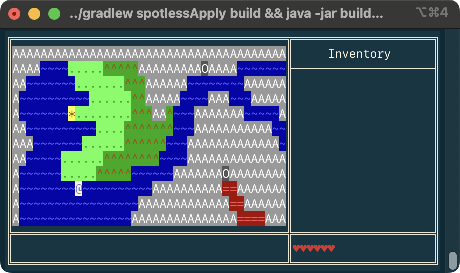

# Text Quest

This project is an incomplete console-based adventure game. 

# Game Overview

The game is a classic text-based top-down adventure game in the style of the original Ultima or
Legend of Zelda series. You can explore the world and will encounter towns you can enter for
trading, caves you can explore for treasure, and enemies that can attack you and reduce your health.
The game interface looks like this:



The screen is split into 4 _panes_. The large pane on the top-left is the map view that shows where
you are. The **Inventory** pane on the top-right shows what items you have. The row of **♥**
characters in the bottom-right pane represents your current state of health (you lose the game if
you lose all your health). The bottom-left pane is the **message** area that will display
information throughout the game.

## Keyboard actions

The following keys are used to interact with the game:

| Key | Description |
|:----|:------------|
| <kbd>←</kbd> | Move left |
| <kbd>→</kbd> | Move right |
| <kbd>↑</kbd> | Move up |
| <kbd>↓</kbd> | Move down |
| <kbd>Space</kbd> | Interact (enter, open, and so on) |
| <kbd>⏎ Enter</kbd> | Accept |
| <kbd>n</kbd> | Reject |
| <kbd>s</kbd> | Save game |
| <kbd>Esc</kbd> | Quit game |

## Terrain symbols

The map is composed of the following symbols:

| Symbol | Description |
|:-------|:------------|
| `@`    | player |
| `A`    | mountain |
| `~`    | water |
| `.`    | grass |
| `^`    | forest |
| `=`    | lava |
| `*`    | town |
| `O`    | cave |
| `%`    | chest |
| `&`    | ship |

# Assumptions

This project assumes you have completed the [Tic Tac Toe](../tic-tac-toe/) challenge.

# Running the game

The game is designed to be run from a terminal console. To build and run the game, execute the
following in a terminal from within the same directory as this README file:

```sh
# build the game (and apply Spotless formatting)
../gradlew spotlessApply build

# run the game
java -jar build/libs/text-quest-all.jar

# all-in-one
../gradlew spotlessApply build && java -jar build/libs/text-quest-all.jar
```

You should see something like this:

```
$ ../gradlew spotlessApply build

BUILD SUCCESSFUL in 2s

$ java -jar build/libs/text-quest-all.jar
```

