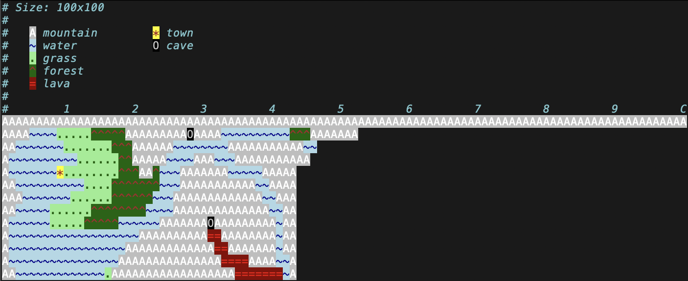

# Vim Syntax Coloring



Copy the files (and their directories) into the `~/.vim` directory. For example:

```sh
for d in colors ftdetect syntax; do mkdir -p ~/.vim/$d; cp $d/* ~/.vim/$d; done
```

You can then edit a map with the color scheme enabled, for example:

```sh
vim -c 'colorscheme tqmap' -c 'syntax on' 0000,0000.tqmap
```
